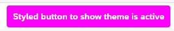
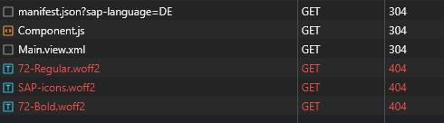
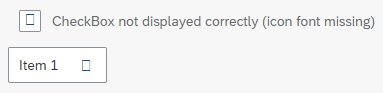

# MWE for [issue #848](https://github.com/SAP/ui5-tooling/issues/848)

This is a minimal working example to demonstrate that built themes don't work standalone as some standard theme assets (fonts) are not copied.

## Files

This repository contains two npm workspaces:

- `theme/` contains a simple theme `my_fiori_3` with just one adjustment (emphasized button)
- `app/` contains a simple app consuming the custom theme

## Usage

- install npm in root dir `npm i`
- build theme: `npm run build` in `theme/` (should happen automatically after installing)
  - self-contained mode is used
- start local dev server: `npm run dev` in `app/`
- open browser [for preview](http://localhost:8080)

The application in `app/` is served. It has the theme `my_fiori_3@/themedist` configured by default.

The route `/themedist` is mapped to the `dist/` folder in the `theme/` folder. So the built theme is served (not the one served by UI5 tooling -- that one can be activated with `sap-theme=my_fiori_3@/themesrc`).

Observe the following:

- the theme is active (footer button is styled)
  - 
- the fonts are not loaded (checkbox checkmark and select arrow should come from icon font)
  - 
  - 
